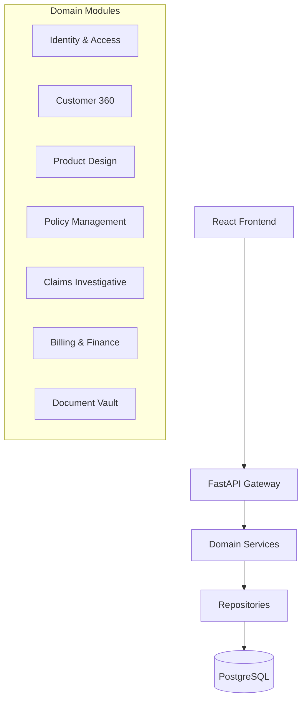

# Architecture Overview - IMP v1.0.0

The Insurance Management Platform (IMP) is designed as a **Modular Monolith**. This approach ensures that business domains are clearly separated while maintaining a simple deployment model.

## 🏗️ High-Level Design

## 💻 Frontend Architecture (React 18)

We utilize an **Atomic Design** philosophy for the component library:
- **Atoms**: Basic building blocks (`Button`, `Badge`, `Card`).
- **Molecules**: Compound components (`FormField`, `StatCard`, `PageHeader`).
- **Organisms**: High-level assemblies (`WorkspaceShell`, `Sidebar`, `DataTable`).

### Data Flow
1. **Components** consume data from **React Query** hooks.
2. **Services** provide a clean interface for data fetching, using a **Factory Pattern** to switch between `Mock` and `Api` implementations.
3. **API Client** handles HTTP communication with standardized interceptors for JWT injection and error mapping.

## ⚙️ Backend Architecture (FastAPI)

The backend follows a **Layered Architecture**:
1. **API Endpoints**: RESTful controllers handling request validation and response serialization.
2. **Services**: Core business logic layer where decisions and state transitions occur.
3. **Models**: SQLAlchemy 2.0 ORM entities with automated audit logging.
4. **Schemas**: Pydantic V2 models for strict type validation and camelCase/snake_case conversion.

## 🔐 Security & RBAC

Access is controlled via **Role-Based Access Control (RBAC)**:
- **Customer**: Access to personal policies, claims, and purchase wizard.
- **Agent**: Operations level access (KYC review, claim investigation).
- **Manager**: Governance level access (Product builder, approval queues, reports).
- **Admin**: System level access (User management, audit logs, global settings).

All cross-domain access is protected against **IDOR (Insecure Direct Object Reference)** at the service layer.
