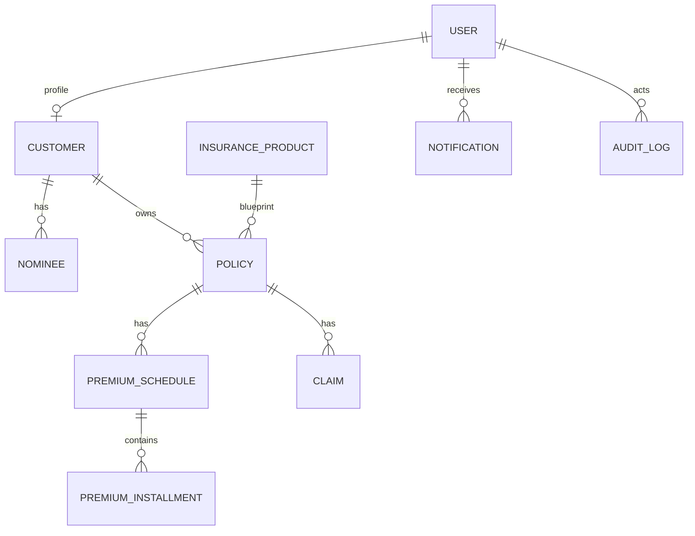

# Database Design - Insurance Management Platform (IMP)

This document translates the Domain Model into a relational schema for PostgreSQL.

## 1. Design Principles
- **UUIDs**: All primary keys use UUID v4 for security and distributed system readiness.
- **Enums**: Native PostgreSQL enums for status and category fields.
- **JSONB**: Used for flexible metadata (e.g., address details, required documents list).
- **Auditability**: Every table includes `created_at` and `updated_at` where relevant.
- **Data Integrity**: Strict Foreign Key constraints and unique indexes.

## 2. Entity Relationship Diagram (Conceptual)

## 3. Schema Definitions

### Identity & Access (IAM)
#### `users`
- `id`: UUID (PK)
- `email`: VARCHAR(255) (Unique, Index)
- `password_hash`: TEXT
- `role`: ENUM ('ADMIN', 'MANAGER', 'AGENT', 'CUSTOMER')
- `is_active`: BOOLEAN (Default: TRUE)
- `created_at`: TIMESTAMP
- `updated_at`: TIMESTAMP

### Customer Management
#### `customers`
- `id`: UUID (PK)
- `user_id`: UUID (FK to `users.id`)
- `full_name`: VARCHAR(255)
- `phone`: VARCHAR(20) (Unique)
- `dob`: DATE
- `kyc_status`: ENUM ('NOT_SUBMITTED', 'PENDING', 'VERIFIED', 'REJECTED')
- `address`: JSONB (Fields: street, city, state, zip, country)
- `created_at`: TIMESTAMP
- `updated_at`: TIMESTAMP

#### `nominees`
- `id`: UUID (PK)
- `customer_id`: UUID (FK to `customers.id`)
- `name`: VARCHAR(255)
- `dob`: DATE
- `relationship`: VARCHAR(50)
- `share_percentage`: DECIMAL(5,2)
- `contact_number`: VARCHAR(20)

### Insurance Products
#### `insurance_products`
- `id`: UUID (PK)
- `name`: VARCHAR(255) (Unique)
- `category`: ENUM ('HEALTH', 'VEHICLE', 'LIFE', 'HOME', 'TRAVEL')
- `description`: TEXT
- `min_coverage`: DECIMAL(15,2)
- `max_coverage`: DECIMAL(15,2)
- `waiting_period_days`: INT (Default: 0)
- `required_docs`: JSONB (List of strings)
- `is_active`: BOOLEAN (Default: TRUE)
- `created_at`: TIMESTAMP
- `updated_at`: TIMESTAMP

### Policy Management
#### `policies`
- `id`: UUID (PK)
- `policy_number`: VARCHAR(50) (Unique, Index)
- `customer_id`: UUID (FK to `customers.id`)
- `product_id`: UUID (FK to `insurance_products.id`)
- `coverage_amount`: DECIMAL(15,2)
- `premium_frequency`: ENUM ('MONTHLY', 'QUARTERLY', 'HALF_YEARLY', 'YEARLY')
- `start_date`: DATE
- `end_date`: DATE
- `status`: ENUM ('DRAFT', 'ACTIVE', 'LAPSED', 'CANCELLED', 'EXPIRED')
- `created_at`: TIMESTAMP
- `updated_at`: TIMESTAMP

#### `policy_nominees` (Junction Table)
- `policy_id`: UUID (FK to `policies.id`)
- `nominee_id`: UUID (FK to `nominees.id`)
- (PK: `policy_id`, `nominee_id`)

### Billing & Premiums
#### `premium_schedules`
- `id`: UUID (PK)
- `policy_id`: UUID (FK to `policies.id`)
- `total_premium`: DECIMAL(15,2)
- `created_at`: TIMESTAMP

#### `premium_installments`
- `id`: UUID (PK)
- `schedule_id`: UUID (FK to `premium_schedules.id`)
- `due_date`: DATE
- `amount`: DECIMAL(15,2)
- `status`: ENUM ('PENDING', 'PAID', 'OVERDUE', 'WAIVED')
- `payment_date`: TIMESTAMP (Nullable)
- `transaction_id`: VARCHAR(100) (Unique, Nullable)
- `receipt_number`: VARCHAR(50) (Unique, Nullable)

### Claims Management
#### `claims`
- `id`: UUID (PK)
- `policy_id`: UUID (FK to `policies.id`)
- `claim_number`: VARCHAR(50) (Unique, Index)
- `type`: VARCHAR(50)
- `incident_date`: DATE
- `description`: TEXT
- `estimated_loss`: DECIMAL(15,2)
- `approved_amount`: DECIMAL(15,2) (Default: 0.00)
- `status`: ENUM ('SUBMITTED', 'UNDER_REVIEW', 'VERIFIED', 'APPROVED', 'REJECTED', 'SETTLED')
- `created_at`: TIMESTAMP
- `updated_at`: TIMESTAMP

### Infrastructure
#### `document_metadata`
- `id`: UUID (PK)
- `owner_id`: UUID (Generic ID)
- `owner_type`: VARCHAR(50) (e.g., 'CUSTOMER', 'CLAIM', 'POLICY')
- `category`: VARCHAR(50) (e.g., 'KYC_AADHAAR', 'CLAIM_MEDICAL')
- `file_path`: TEXT
- `file_type`: VARCHAR(50)
- `created_at`: TIMESTAMP

#### `notifications`
- `id`: UUID (PK)
- `user_id`: UUID (FK to `users.id`)
- `title`: VARCHAR(255)
- `message`: TEXT
- `status`: ENUM ('PENDING', 'SENT', 'READ', 'ARCHIVED')
- `created_at`: TIMESTAMP

#### `audit_logs`
- `id`: BIGSERIAL (PK)
- `timestamp`: TIMESTAMP
- `actor_id`: UUID (FK to `users.id`, Nullable for system)
- `action`: VARCHAR(100)
- `entity_type`: VARCHAR(50)
- `entity_id`: UUID
- `changes`: JSONB (Schema: {old: {}, new: {}})
